# Frontend Design Audit — Best Ball / DFS 2026 Dashboard Suite

**Date:** 2026-07-02 · **Auditor:** design-lead review, day 1 · **Method:** every main dashboard rendered in headless Chromium (Playwright) at desktop 1440×900 and mobile 390×844, plus interaction states (row drilldowns, tabs, team/player selection). Console/pageerror capture on every load. Nothing in this report is assumed from source alone — every claim was screenshotted.

**Lens:** can a normal fantasy drafter who has never seen this tool (a) understand what it is, (b) trust the numbers, and (c) get from landing → understanding a player/tier → a confident draft pick, without docs?

---

## 1. What this product is (day-1 read)

A **generated-HTML analytics suite for NFL best ball (2026 season) and weekly DFS**, built by Python render scripts over a real data pipeline (nflfastR PBP, FantasyPoints charting, Clay projections, sims). There are ~16 user-facing dashboards. `home.html` is the intended hub ("Fantasy Command Center") organizing everything under three goals: **Best Ball Draft**, **DFS Weekly**, **The Dossier**. The core action is: open hub → pick a board (rankings / big board / ADP tiers) → drill into a player's "why" (the shared 4-layer context drilldown) → make a draft pick (assisted live by `pick_dashboard` / `decision_dashboard`).

**Overall verdict:** the analytical content is unusually strong and the trust signals (build timestamps, data sources, per-metric percentile labels, plain-English "booms when" text) are better than most commercial tools. The two things holding it back are **navigation** (every page except home is a dead end) and **orientation** (four overlapping "which player is best" boards with three different #1 players and no guidance on which board to draft from). Comprehension inside a page is mostly good; comprehension *across* pages is where a new user gets lost.

**No console errors or page errors on any of the 16 pages, at either viewport.** JS is clean everywhere. Load times ~2.5–3.3s for the largest (2–3 MB) pages.

### 5-second test, page by page

| Page | 5-second verdict |
|---|---|
| `home.html` | **Pass.** "Fantasy Command Center — one home for the three tools." Goals, buttons, links. You know what it is and what to click. (CLI commands in cards signal "power tool", see issues.) |
| `command_center.html` | **Pass with damage (now fixed).** Title + source line are excellent; but the column-header row floated mid-table over row 3 (fixed in this audit) and the tabs→content dead band makes the first screen feel half-loaded. |
| `rankings.html` | **Pass.** "2026 Rankings", 481 players, methodology one-liner, table is self-evident. Column meanings need hover/legend (improved in this audit). |
| `adp_cluster_board.html` | **Pass — best intro copy in the suite.** Explains tiers, the composite (ceiling 50/traits 25/matchup 25), what green/REACH/vs-pick mean, all above the fold. |
| `big_board_2026.html` | **Pass.** One-line methodology + per-player "why" text. `Δ MKT`/`PO MQ` columns are cryptic. |
| `dossier.html` | **Pass.** Team list + "Select a team." Selecting BUF gives identity, strengths/weaknesses, booms/busts-when — genuinely readable. |
| `dossier_deep.html` | **Borderline.** No page title at all on first paint — just a search box, player list, and an italic hint. The hint copy is good, but the page doesn't say what it is. |
| `player_explorer.html` | **Pass.** Auto-selects a player (Gibbs) and immediately shows "CEILING PROFILE — WHAT UNLOCKS A CEILING GAME" with the ceiling-rate definition spelled out. Jargon-dense below the fold. |
| `lever_board.html` | **Borderline.** The intro paragraph does explain the concept, but "tier-weighted count of… stability-audited FantasyPoints ceiling levers get turned on" is a wall of jargon for a first-timer; columns SZN/PLAYOFF/PEAK are unitless. |
| `upside_cases.html` | **Pass — best player page for a normal human.** Big "57% CEILING RATE", plain-English paragraph, "BOOMS WHEN" chips. |
| `dfs_week.html` | **Borderline.** "DFS Weekly Model — Week 15" in July with no season context; a new user can't tell if this is last year, a projection, or stale. Legend box itself is good. |
| `pick_dashboard.html` | **Pass on content, fails on reconciliation.** Clear verdict banner + candidates, but the banner ("TAKE Jaxson Dart") disagrees visually with the #1-highlighted row (Kittle) — at the exact decision moment. |
| `decision_dashboard.html` | **Pass.** Pick/round/seat, roster chips, "HEADLINE PICK" with a Why, decision tree in if/else language. Best conversion page in the suite. dTitle/dAdv units unexplained. |
| `team_dashboard.html` | **Borderline.** Wall of collapsed team accordions; "α-ceiling", "cl 46", "#2" chips undefined. (Its "40% ceil ceil" badge bug fixed in this audit.) |
| `team_scout.html` | **Pass.** Team cards, coaches, O/U, "OFFENSE — WHO GETS THE BALL". Offense/Defense bar numbers (16/56) are unlabeled percentiles. |
| `intel.html` | **Fail → improved.** Title "Intel" + empty state "Select." said nothing. (Empty-state copy fixed in this audit; page reveals a genuinely novel "claim backtest" of analyst tweets once a player is clicked.) |

**Pages skipped and why:** `dossier_preview.html`, `descriptor_prototype_worthy.html`, `lever_calendar_josh_allen.html`, `sample_decision_dashboard_DK.html` (one-off previews/prototypes/samples, not part of the main flow), and the five `_*.html` template files (generator inputs, not user pages).

---

## 2. Page-by-page findings

Severity: **P0** blocks understanding/trust/task · **P1** major friction · **P2** meaningful polish · **P3** nice-to-have.
Dimension: which of **understanding / trust / core-action** it hurts.

### 2.1 home.html — the hub

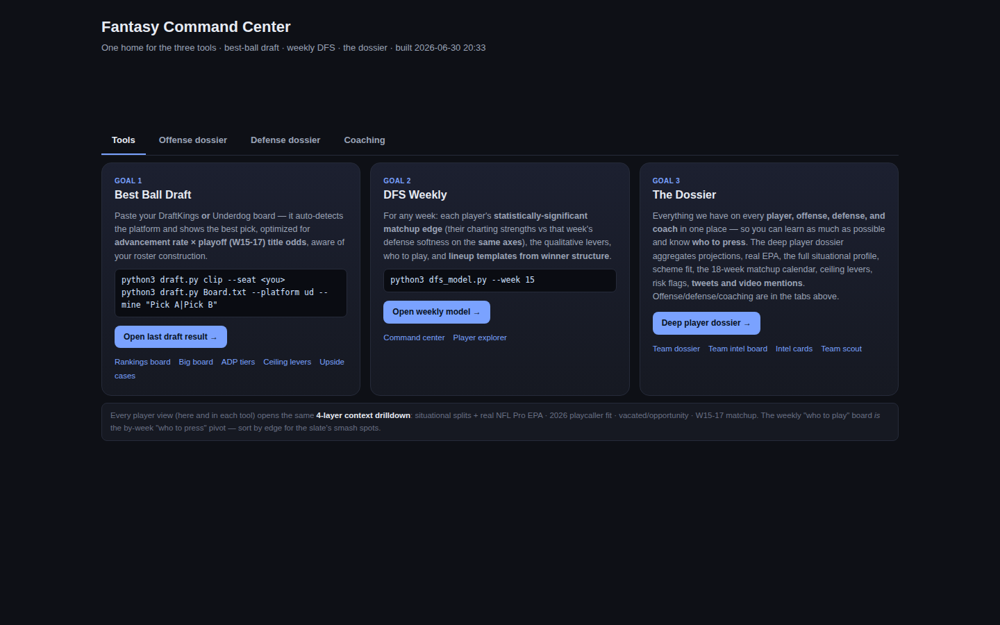
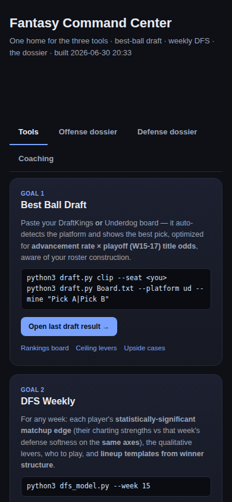
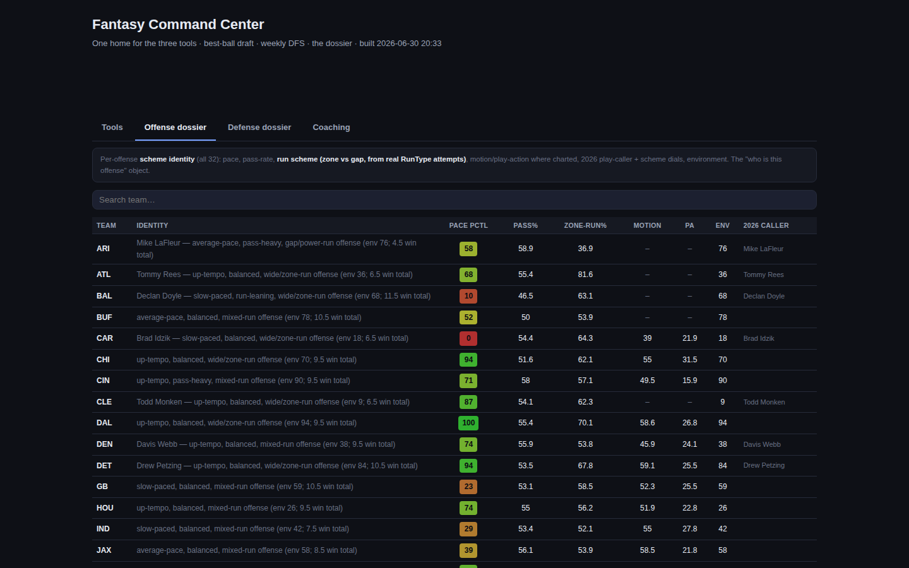

Good: instantly legible purpose; build timestamp ("built 2026-06-30 20:33"); the Offense/Defense/Coaching tabs put real 32-team scheme tables one click from landing; mobile is clean.

- **[P1 · core-action] 4 dashboards were unreachable from the hub** — `adp_cluster_board.html`, `big_board_2026.html`, `team_dashboard.html`, `pick_dashboard.html` had no inbound link anywhere. Two of them are core draft boards. **FIXED:** added "Big board", "ADP tiers" (Goal 1) and "Team intel board" (Goal 3) quick links in `build_home.py` + `home.html`. `pick_dashboard` is a per-run artifact; leaving it CLI-launched is defensible.
- **[P2 · understanding] Naming collision with command_center.html.** The hub's H1 is "Fantasy Command Center"; a different page is titled "Best Ball / DFS 2026 — Command Center". Two "command centers" = guaranteed confusion in conversation and in tabs. Fix: rename the hub H1 to "Fantasy Command — Home" (matches its `<title>`) or rename the Goal-2 link to "Fusion board".
- **[P2 · understanding] Raw CLI commands (`python3 draft.py clip --seat <you>`) sit unexplained in the primary cards.** A normal user reads these as broken content. Fix: prefix with a muted label line "Run from a terminal to refresh:" (one string in `build_home.py`).
- **[P3 · core-action] Primary CTA "Open last draft result →" assumes a previous run.** If `decision_dashboard.html` is stale, the user lands on an old pick-69 state with no banner saying so. Fix: caption under the button, "shows your most recent draft run (see built time on that page)".
- **[P3 · visual] Large empty band between the subtitle and the tabs** (~90px) makes the first paint feel unfinished. Fix: reduce header padding in `build_home.py` CSS.

### 2.2 command_center.html — model fusion board

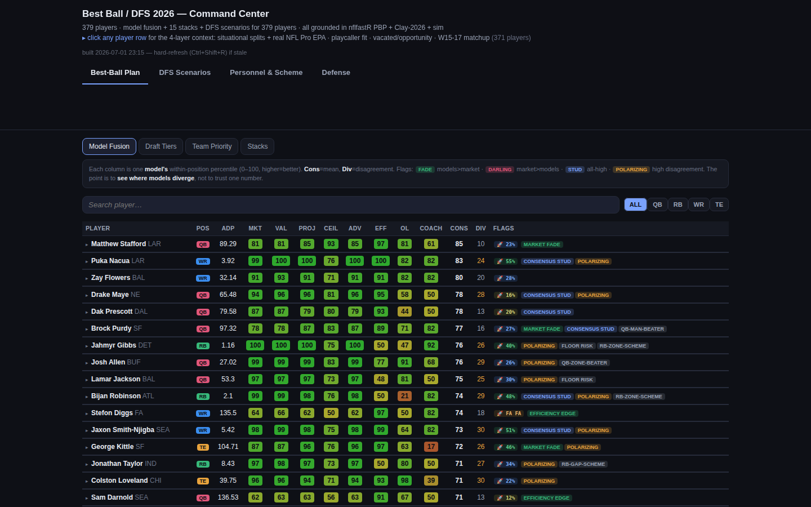
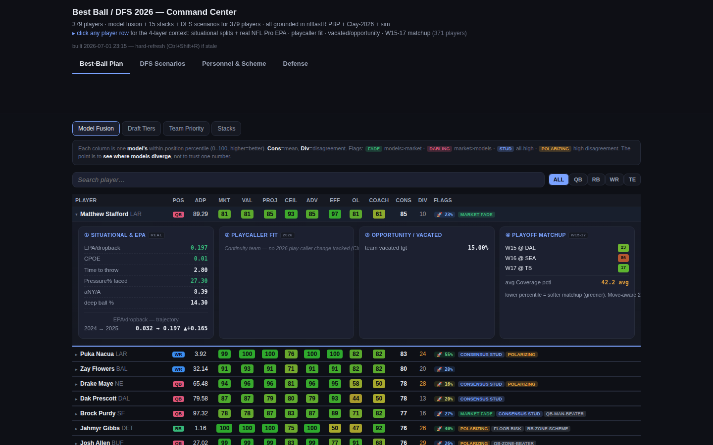
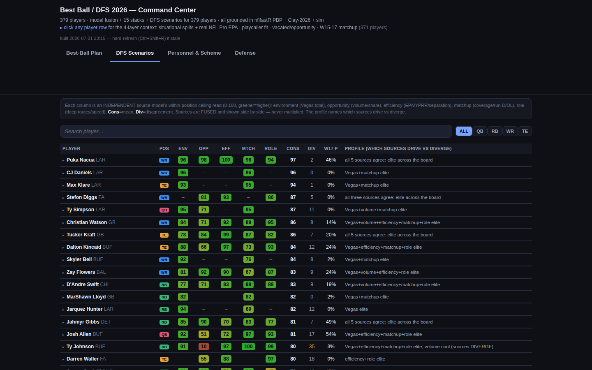
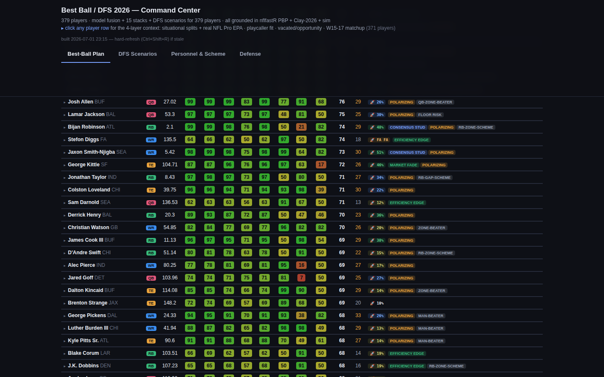
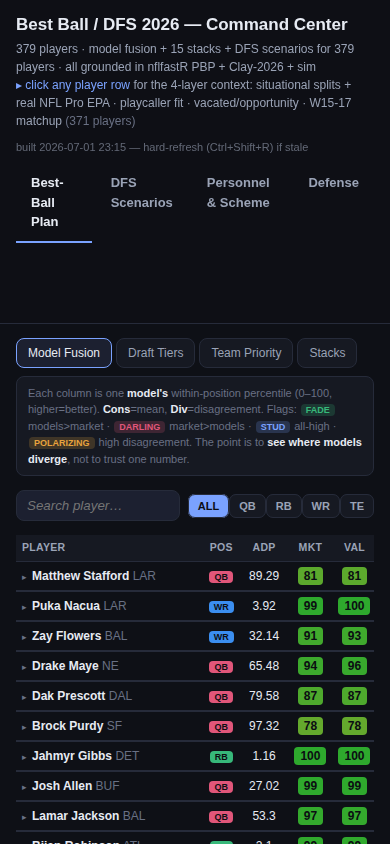

Good: the source line ("all grounded in nflfastR PBP + Clay-2026 + sim"), build timestamp, a legend that explains the whole table ("Each column is one model's within-position percentile (0–100, higher=better)… The point is to see where models diverge, not to trust one number") — that last sentence is exactly the right trust posture. The 4-layer row drilldown (Situational & EPA / Playcaller fit / Opportunity-vacated / Playoff matchup) is the best "why" component in the suite and is reused consistently on rankings, player_explorer, upside_cases, intel, pick_dashboard.

- **[P0 · understanding+core-action] FIXED — column header row rendered 96px *inside* the table.** `th{position:sticky;top:96px}` was written for viewport-sticky, but the table sits in an `overflow:auto` wrapper, which becomes the sticky containing scroller — so the header row painted on top of data row 3, the first two rows appeared *above* their own header, and **clicks on covered rows were intercepted** (Playwright could not click row 1; z-index 5 header ate the tap). Same bug on `dfs_week.html` (shared CSS). Fixed to `top:0` in `_cc_template.html:18` and `render_dfs_week.py:30` (+ both generated files). Verified: header above row 1, row clicks open the drilldown.
- **[P1 · understanding] Column headers vanish once you scroll** (see `command_center_scrolled.png`) — 14 numeric columns, 379 players, and no header in view after ~10 rows. The `top:0` fix removes the corruption but headers still scroll away because of the wrapper. Recommend (structural): drop `overflow:auto` from the table wrapper on ≥1200px screens (the table fits 1180px anyway) so `th` sticks to the viewport under the sticky page header — change wrapper to `overflow-x:auto` inside a media query, or give the wrapper `max-height:80vh; overflow:auto` so the header sticks within a scrollable panel.
- **[P1 · understanding] Drilldown card text truncates mid-word:** "Continuity team — no 2026 play-caller change tracked (Cl…", "Move-aware 2…" (see `command_center_row_expanded.png`). The `.ctxwrap` cards clip instead of wrapping. Recommend: `white-space:normal; overflow-wrap:anywhere` on the card body class in `_cc_template.html`.
- **[P2 · trust] "W17 P" column (DFS tab) and "Δ MKT" glyph "·" are undefined.** Fix: `title=` tooltips ("probability of a W17 ceiling game"; "movement vs market rank").
- **[P2 · visual] Same dead band between tabs and content as home** (~90px, see desktop shot). Fix in `_cc_template.html` header/panel margins.

### 2.3 rankings.html — the 481-player draft list

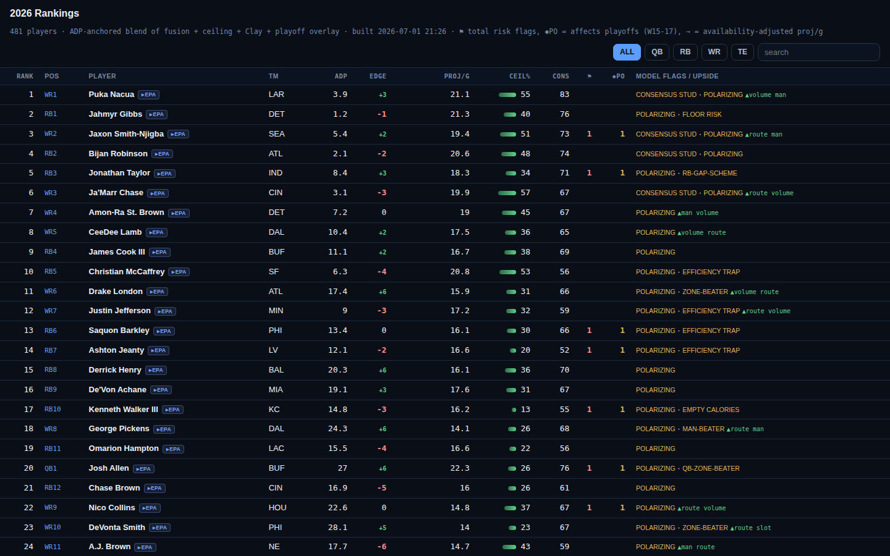
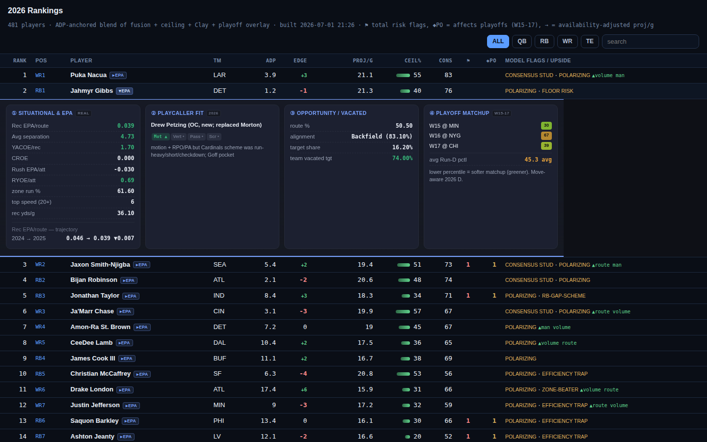
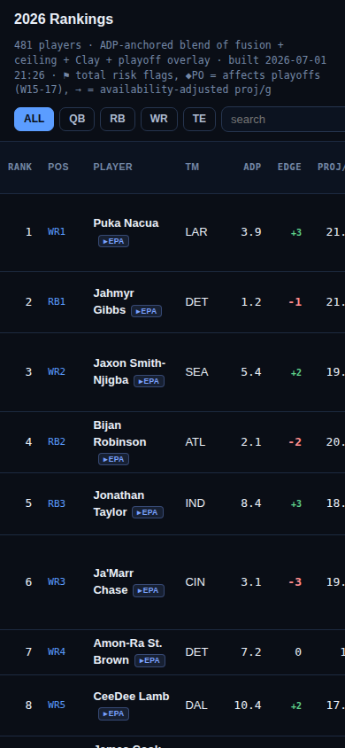

Good: methodology one-liner + built time in the header; position filters; search; the ▸EPA chip opens the same 4-layer drilldown inline (verified, `rankings_epa_expanded.png`) — a drafter can genuinely answer "why is this player ranked here" in two clicks.

- **[P1 · understanding] FIXED (partially) — column meanings undefined at point of use.** "Edge +3", "Cons 76", "Ceil% 55" had no definition on this page (Cons is only explained on command_center). Added `title` tooltips to Edge ("model rank vs ADP, in draft spots — positive = market undervalues"), Proj/g, Ceil% ("ceiling rate — % of weeks with a ceiling game"), Cons ("consensus — mean of model percentiles (0-100)") in `build_rankings.py` + `rankings.html`, matching the existing tooltip pattern on the two flag columns. Remaining recommendation: tooltips are invisible on touch — promote these four definitions into the legend line.
- **[P1 · understanding] Model-flag vocabulary is unexplained:** POLARIZING, EFFICIENCY TRAP, EMPTY CALORIES, ZONE-BEATER, MARKET FADE. Is POLARIZING good? (It means high model disagreement — defined only on command_center's legend.) Recommend: one glossary line under the header, or `title=` on each `.fl` chip class in `build_rankings.py`.
- **[P2 · mobile] 265px horizontal overflow at 390px** — the columns that answer the question (Ceil%, Cons, flags) are off-screen with no scroll affordance (`rankings_mobile.png`). Recommend: `position:sticky;left:0` on the player-name column + a fade-edge cue.
- **[P2 · visual] The expanded EPA panel overflows the table's right edge** (`rankings_epa_expanded.png`, dark slab past the FLAGS column). Cosmetic; recommend constraining `.ctxwrap` width to the table box.

### 2.4 adp_cluster_board.html — best pick per ADP tier

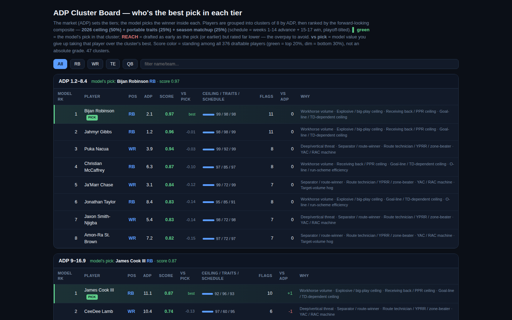
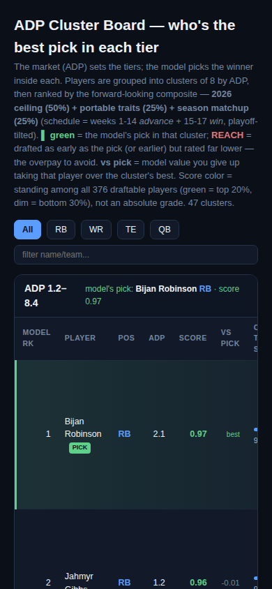

Good: **the best self-explaining page in the suite.** The intro defines the tiering, the composite weights, REACH, "vs pick", and even warns the score color is "not an absolute grade". The green PICK row + "WHY" column directly serves the core action ("who do I take in this tier?").

- **[P1 · trust] "FLAGS 11" means the *opposite* of "flags" on rankings/dossier.** Here it counts positive trait flags (workhorse volume, explosive…); on rankings/dossier ► flags = *risk* flags. Same word, opposite valence, two flagship pages. Recommend: rename this column header to "TRAITS" in `build_adp_clusters.py`.
- **[P2 · mobile] FIXED — missing `<meta viewport>`** meant real phones rendered the page as a zoomed-out 980px desktop page. Added the meta in `build_adp_clusters.py:73` + generated file. At 390px the layout wraps acceptably (screenshot above is the post-meta rendering).
- **[P3 · understanding] "Score 0.97" scale undefined** (0–1 composite). One clause in the intro would close it.

### 2.5 big_board_2026.html

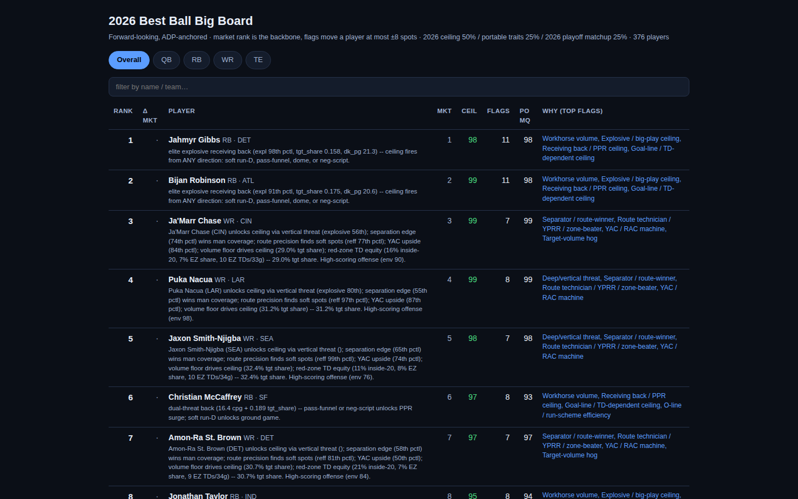
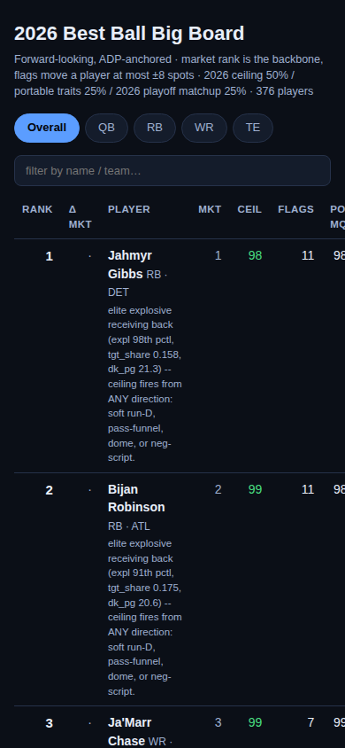

Good: honest methodology ("market rank is the backbone, flags move a player at most ±8 spots"); per-player why-text with percentile receipts ("expl 98th pctl, tgt_share 0.158").

- **[P1 · trust] Different #1 than rankings.html with no explanation** (Gibbs here, Nacua there; ADP board says Bijan in tier 1). See cross-cutting issue C3 — this page needs the "when to use me" line most.
- **[P2 · understanding] "PO MQ" and the "Δ MKT" dot column are undefined.** Fix: `title=` tooltips in `build_big_board.py` ("playoff-weeks matchup percentile"; "rank change vs market"). 
- **[P2 · mobile] 105px overflow at 390px;** WHY column off-screen. Same sticky-name-column recommendation as rankings.

### 2.6 dossier.html — team dossiers

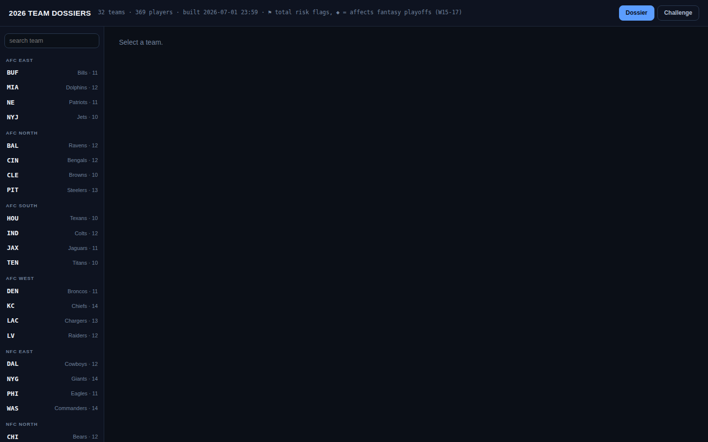
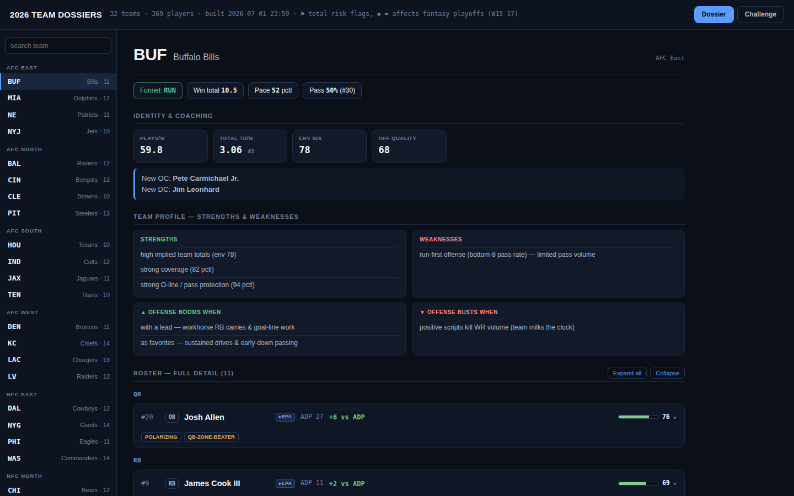
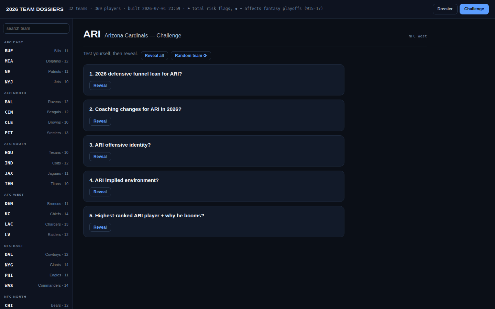
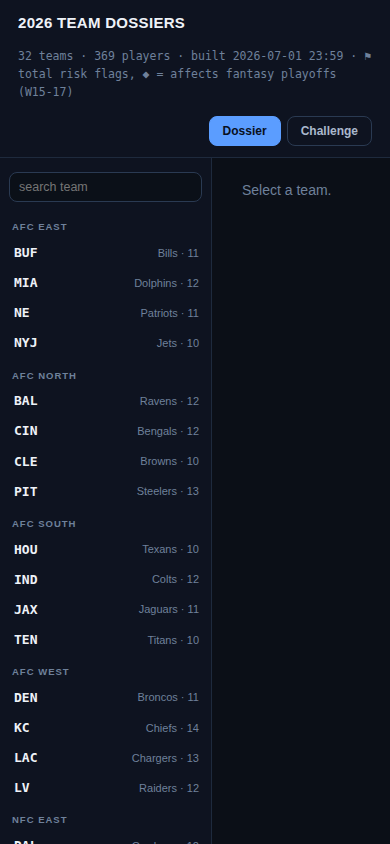

Good: per-team identity chips, strengths/weaknesses, "OFFENSE BOOMS WHEN / BUSTS WHEN" in plain English, roster with ADP-vs-rank deltas. The "Challenge" quiz mode is a genuinely clever study tool.

- **[P2 · trust] FIXED — "Pace 52th"** (every team; also "1th", "23th"…) — hardcoded `th` ordinal suffix, and it didn't even say the number was a percentile. Now renders "Pace 52 pctl" (`render_dossier.py:237` + `dossier.html`). Same fix applied to "college ceiling 91th pctl" → "91 pctl" (`render_dossier.py:226`).
- **[P2 · understanding] "ENV IDX 78", "OFF QUALITY 68" cards are unitless** (both 0–100 scales). Recommend `title=` tooltips in `render_dossier.py`.
- **[P3 · understanding] "Challenge" toggle is unexplained until clicked.** Recommend `title="quiz yourself on each team, then reveal"`.
- **[P3 · core-action] Empty state "Select a team." could auto-select the first team** (player_explorer auto-selects and is better for it).

### 2.7 dossier_deep.html — deep player dossier

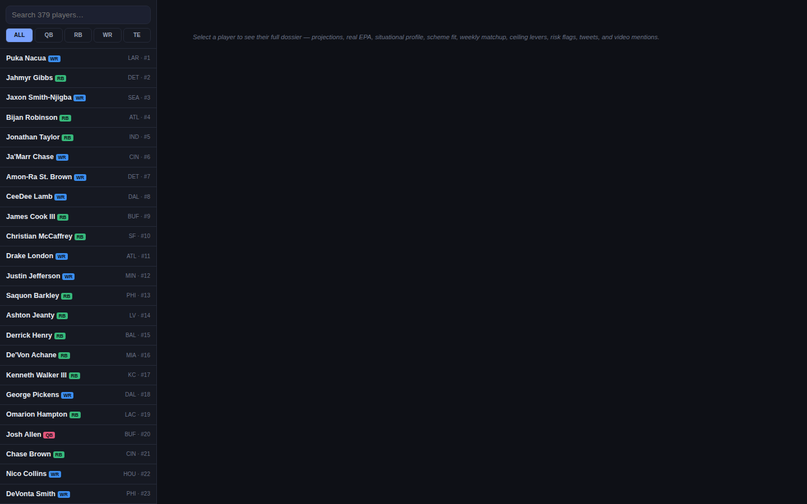
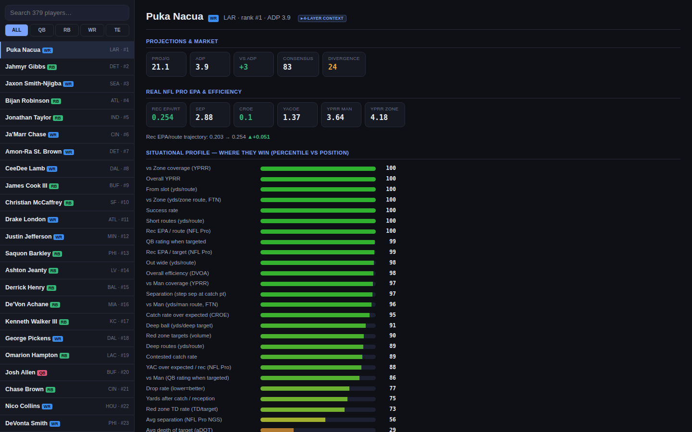
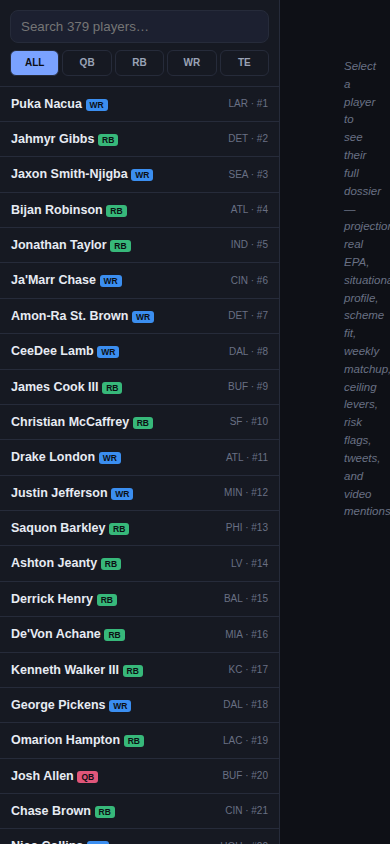

Good: this is the "why" engine. "SITUATIONAL PROFILE — WHERE THEY WIN (PERCENTILE VS POSITION)" with ~25 labeled percentile bars, each metric carrying its source in parentheses (YPRR, FTN, NFL Pro, DVOA) — the single best trust artifact in the product.

- **[P1 · understanding] The page has no title/identity on first paint.** The main pane is blank except an italic hint; there's no H1 anywhere (browser tab says "Player Dossier — Deep"). A user arriving from home's "Deep player dossier →" button gets an unlabeled search pane. Recommend: add a small header bar (title + player count + built time) in `build_dossier_deep.py`, consistent with every other page.
- **[P2 · understanding] Metric cards "SEP 2.88", "CROE 0.1", "YACOE 1.37" lead with unexplained acronyms** (they are defined further down in bar labels). Recommend `title=` expansions on the card labels.
- **[P3 · trust] No auto-selection** — one extra click vs player_explorer for the same job.

### 2.8 player_explorer.html

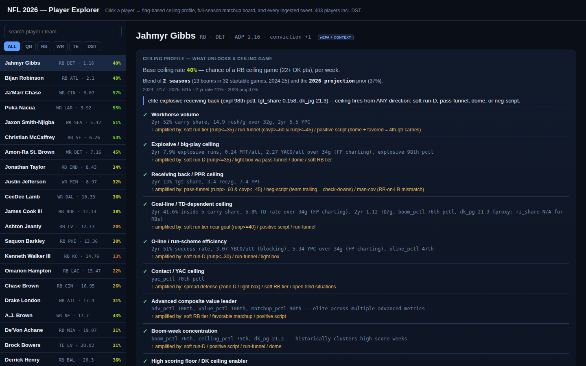
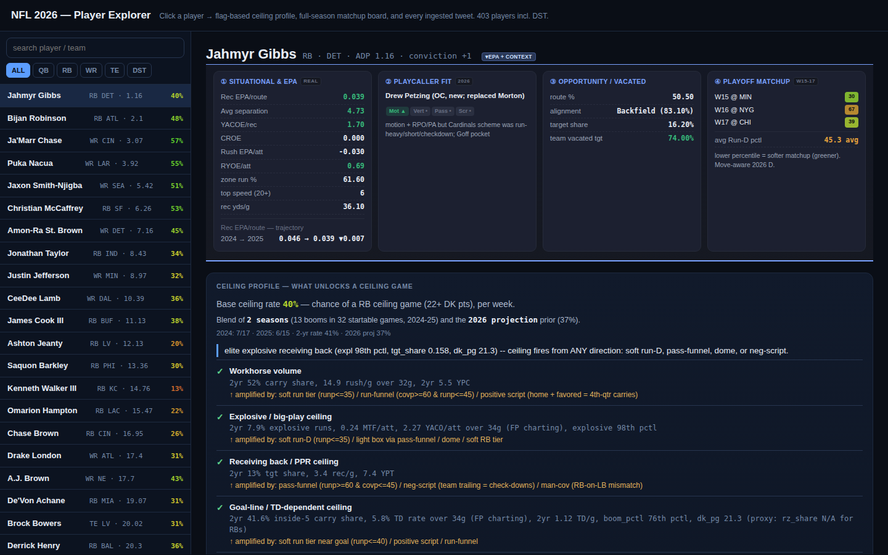
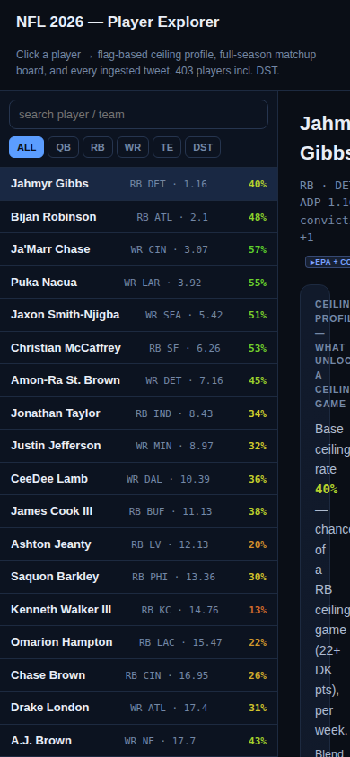

Good: auto-selects; defines its headline number in a sentence ("Base ceiling rate 40% — chance of a RB ceiling game (22+ DK pts), per week. Blend of 2 seasons… and the 2026 projection prior (37%)."); each ceiling skill shows its receipts and its amplifiers.

- **[P2 · understanding] Amplifier lines are pure pipeline shorthand:** "soft run tier (runp<=35) / run-funnel (covp>=60 & runp<=45)". Tolerable for the owner; recommend a one-line key at the top of the skills section ("runp/covp = opponent run/coverage percentile").
- **[P2 · understanding] "conviction +1" chip in the header is undefined.** Recommend `title=` ("count of model flags pointing the same direction, net").
- **[P3] Left-list percentages are unlabeled** (they're ceiling rates) — a "CEIL%" mini-header on the list would close it.

### 2.9 lever_board.html

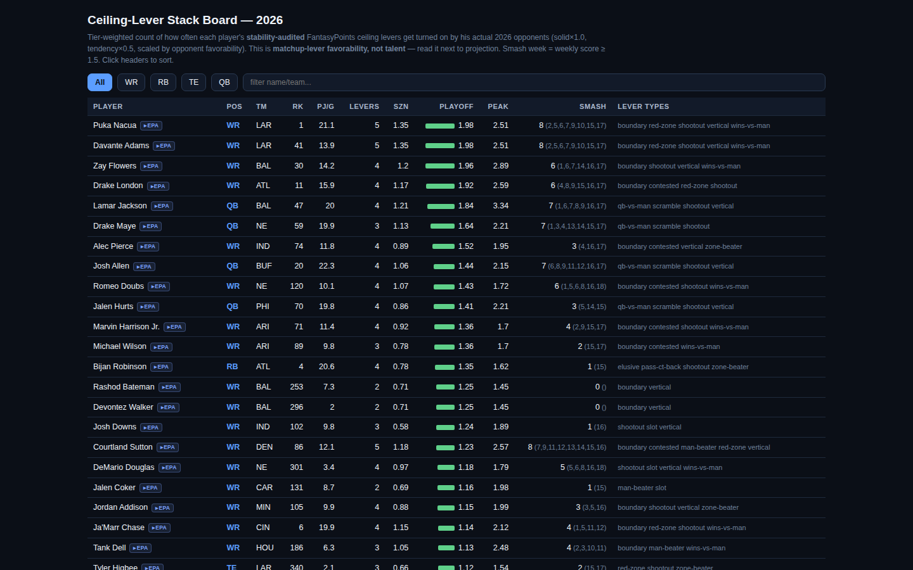
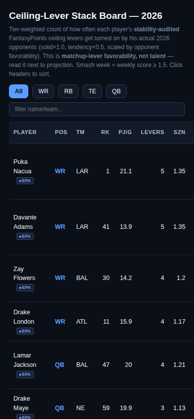

- **[P1 · understanding] Column units undefined:** SZN 1.35, PLAYOFF 1.98, PEAK 2.51 — per-week average lever score? sum? A drafter can rank by them but can't explain them. The intro defines "smash week = weekly score ≥ 1.5" which *implies* per-week score, but the columns never say. Recommend `title=` tooltips in `build_lever_board.py` ("season avg weekly lever score", "W15-17 avg", "best single week").
- **[P2 · trust] Teammates show identical lever rows** (Nacua & Adams, both LAR: 5 levers, 1.35, 1.98, 2.51, 8 smash weeks, same week list) — reads as a copy-paste bug until you deduce levers are opponent-schedule-driven. One clause in the intro ("teammates share a schedule, so their matchup-lever rows can match") converts a trust-killer into a teachable moment.
- **[P2 · mobile] FIXED missing viewport meta** (`build_lever_board.py:33`); remaining: 311px overflow at 390px hides everything right of LEVERS — same sticky-name-column recommendation.

### 2.10 upside_cases.html

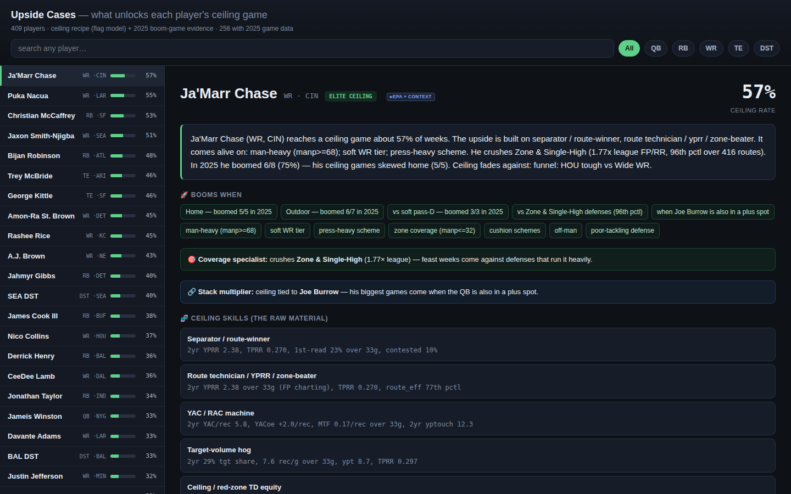
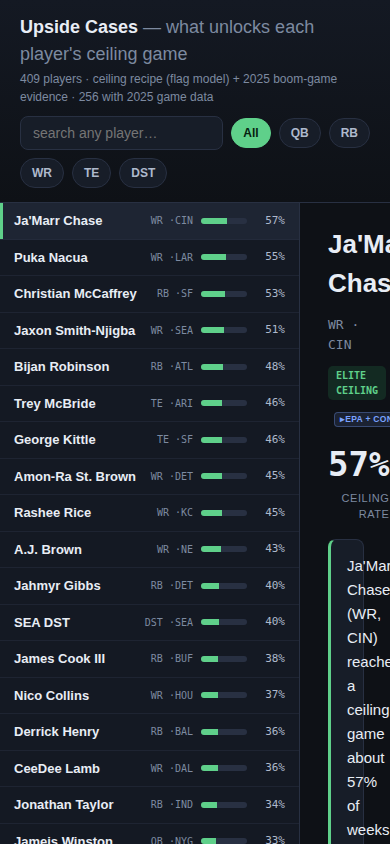

Good: the most normal-human-readable player page — headline ceiling rate with label, a paragraph in English, "BOOMS WHEN" chips, coverage-specialist and stack-multiplier callouts. If a new user only ever saw this page plus a rankings board, they could draft. **No issues worth filing beyond the suite-wide nav gap; this page is genuinely good.**

### 2.11 dfs_week.html

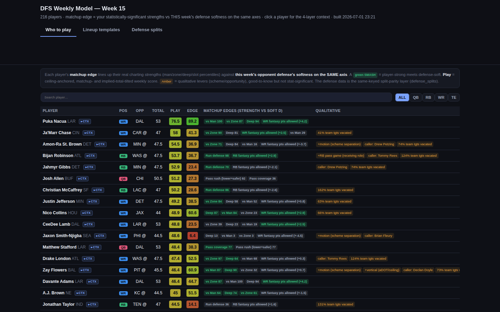
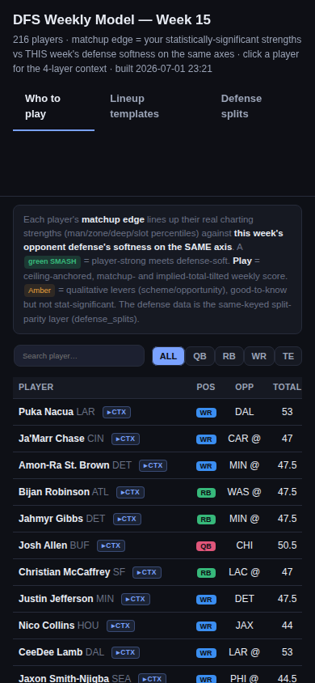

Good: the legend box defines the edge concept, the SMASH chip, the Play score, and amber qualitative chips; matchup-edge chips read "vs Man 100 · vs Zone 87 · Deep 94" with defense-allowed context.

- **[P0 · understanding+core-action] FIXED — same floating-header bug as command_center** (`render_dfs_week.py:30`, shared CSS). Header sat over data rows and intercepted clicks; now at table top.
- **[P1 · trust] "Week 15" with no season anchor.** Opened in July, nothing says whether this is 2025-actuals or the projected 2026 W15 slate. Recommend: append season context to the H1 in `render_dfs_week.py` ("— Week 15, projected 2026 slate") and/or a sub-line "matchups from the 2026 schedule".
- **[P2 · understanding] "TOTAL 53 / PLAY 76.5 / EDGE 89.2" columns:** TOTAL is the Vegas game total (unlabeled), PLAY is defined in the legend, EDGE's 0–100 scale isn't. `title=` tooltips.

### 2.12 pick_dashboard.html — the actual draft-pick moment

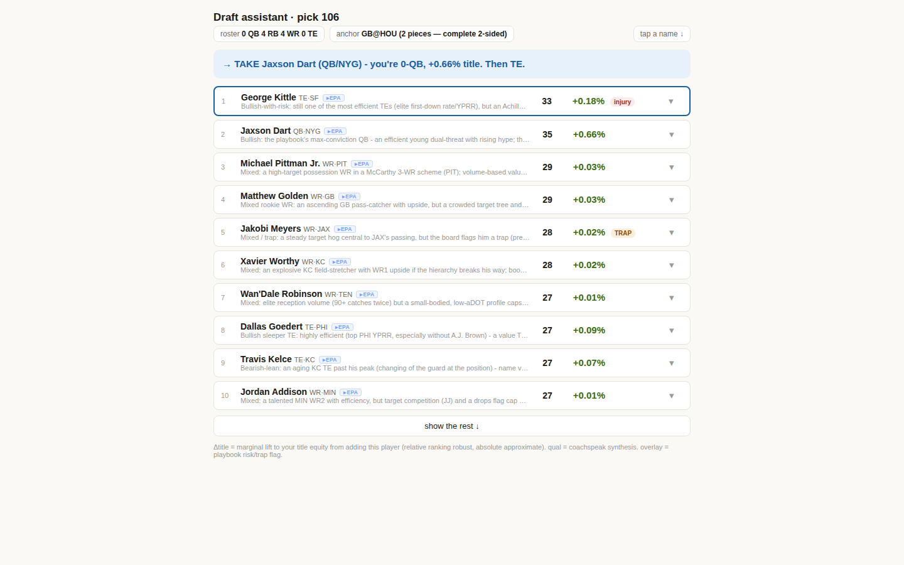
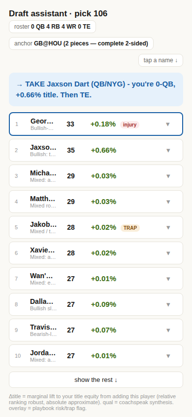

Good: verdict banner in plain English ("TAKE Jaxson Dart (QB/NYG) - you're 0-QB, +0.66% title. Then TE."), roster/anchor context chips, Δtitle per candidate, TRAP/injury overlays, footnote defining Δtitle.

- **[P1 · core-action] The banner and the list disagree visually.** Banner says take **Dart**; the #1 row with the highlighted border is **Kittle** (board order), and Dart sits at #2 with a *higher* Δtitle (+0.66% vs +0.18%) and higher middle number (35 vs 33). At the moment of decision the user must resolve three conflicting cues. Recommend (in `dashboard.py`/`_dash_template.html`): move the highlight border to the row matching the verdict player, or add a "recommended" chip to that row; keep board order otherwise.
- **[P1 · core-action, mobile] Names truncate to ~5 characters on a phone** ("Geor…", "Jaxso…", `pick_dashboard_mobile.png`) — live drafts are exactly when users are on a phone. The grid gives fixed 38/64/84px to the numeric columns and starves the name. Recommend: reduce `.row` gap and let the lean/flag column collapse under 480px.
- **[P2 · understanding] FIXED — the middle score column (33/35/29) was totally unlabeled.** It's the p95 weekly ceiling. Added to the footnote: "middle number = p95 weekly ceiling (DK pts)" (`_dash_template.html:21` + `pick_dashboard.html`). A column header row would be the fuller fix.
- **[P2 · consistency] FIXED missing viewport meta** (`_dash_template.html:1`). Note: the page is light-themed in the screenshots but does carry a `prefers-color-scheme:dark` variant, so theme consistency is OK for dark-mode users; light-mode is still a one-off vs the rest of the suite (P3, accept).

### 2.13 decision_dashboard.html

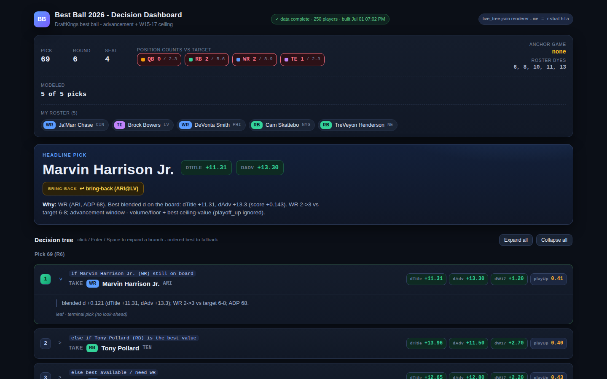
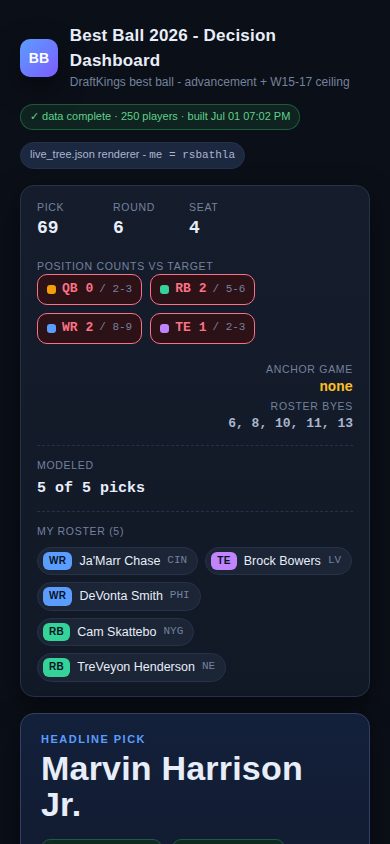

Good: the strongest end-of-funnel page. "✓ data complete · 250 players · built Jul 01 07:02 PM" badge; pick/round/seat; position counts vs target with red/green states; HEADLINE PICK with a Why sentence; a literal decision tree ("if Marvin Harrison Jr. still on board → TAKE … else if Tony Pollard is the best value → …") with Δ chips per branch. Mobile layout is clean.

- **[P2 · understanding] dTitle/dAdv/dW17/playUp chips are never expanded.** The Why line uses them fluently ("dTitle +11.31, dAdv +13.3 (score +0.143)") but no legend exists. Recommend a footnote line like pick_dashboard's (in `build_decision_dashboard.py`).
- **[P3 · trust] "live_tree.json renderer - me = rsbathla"** — internal identity/debug chip in the top right. Harmless, but it reads as leaked debug info; recommend hiding behind a `?debug` flag.
- **[P3 · mobile] 105px overflow** from the wide bye-week string; cosmetic.

### 2.14 team_dashboard.html — team intel board

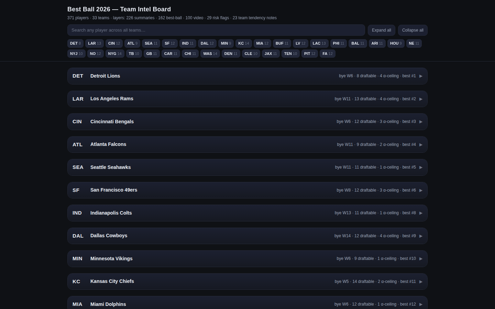
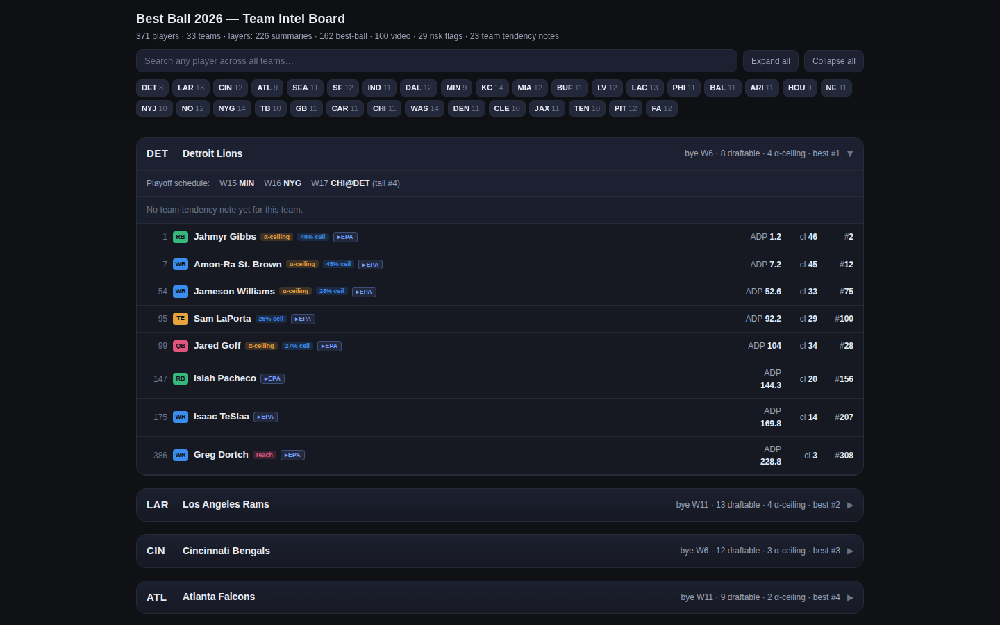
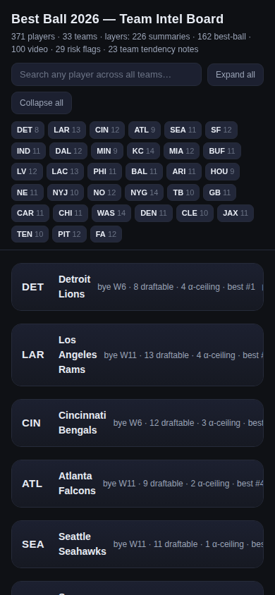

- **[P2 · trust] FIXED — every ELITE/HIGH player badge read "40% ceil ceil"** (badge already ends in "ceil"; the renderer appended another). `_team_template.html:86` + `team_dashboard.html`. Verified gone.
- **[P2 · understanding] Untranslated shorthand row-chips: "α-ceiling", "cl 46", trailing "#2".** cl = p95 weekly ceiling, #N = overall board rank, α-ceiling = p95 ≥ 33. None defined on the page. Recommend a half-line legend under the header in `team_dashboard.py`.
- **[P3 · first-paint] All 32 accordions collapsed on load** — the page communicates nothing until a click. Recommend auto-expanding the first team.

### 2.15 team_scout.html

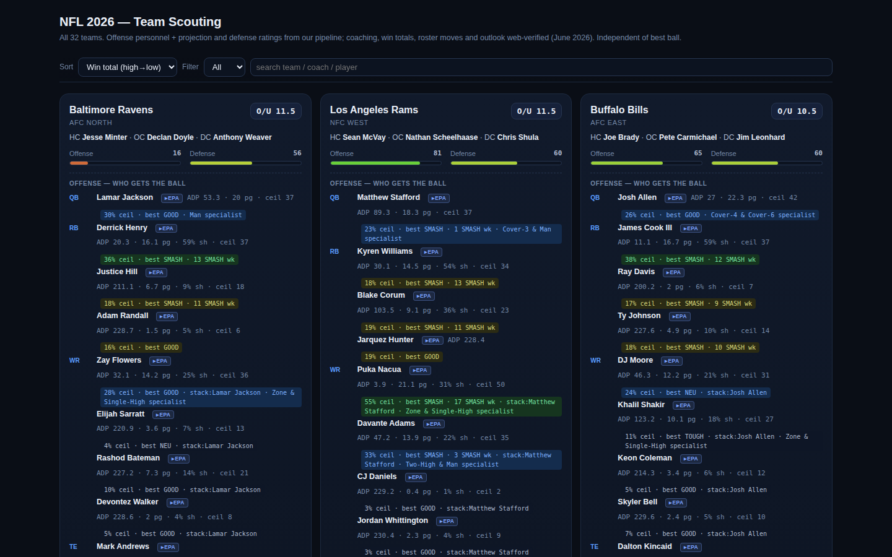
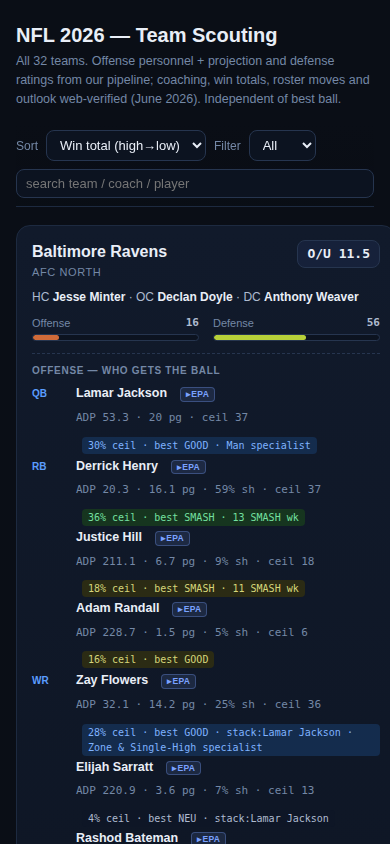

Good: "coaching, win totals, roster moves and outlook web-verified (June 2026)" is a real recency signal; cards are scannable; sort/filter controls exist.

- **[P2 · understanding] Offense/Defense bars show bare numbers (16, 56, 81…) with no unit** — they're percentiles. Recommend "Offense (pctl)" label or `title=` in `build_team_scout.py`.
- **[P3] "best SMASH · 13 SMASH wk" chips** — SMASH is defined on lever_board/dfs_week, not here. Tooltip.

### 2.16 intel.html

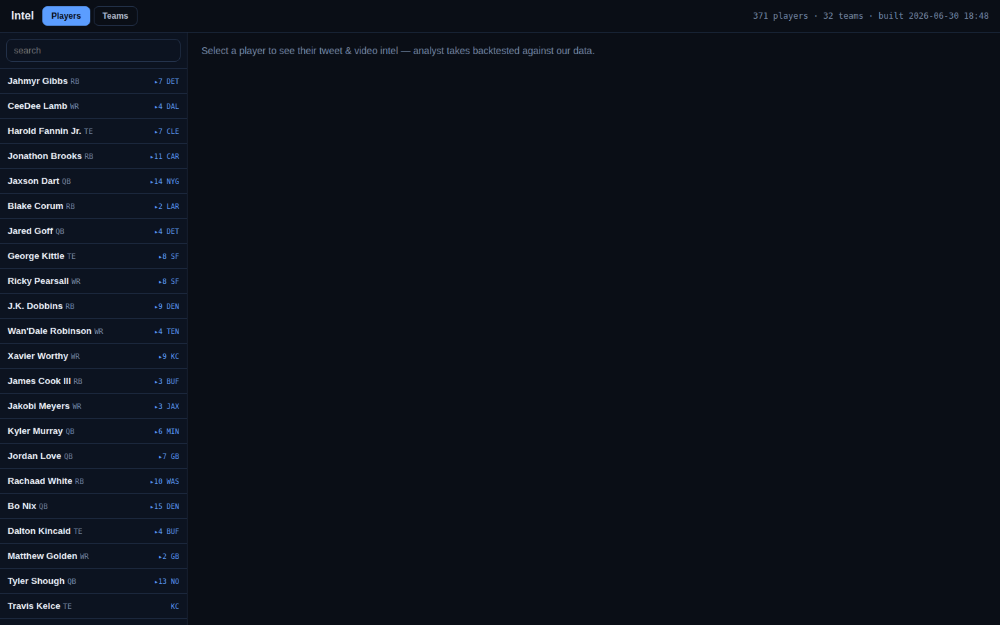
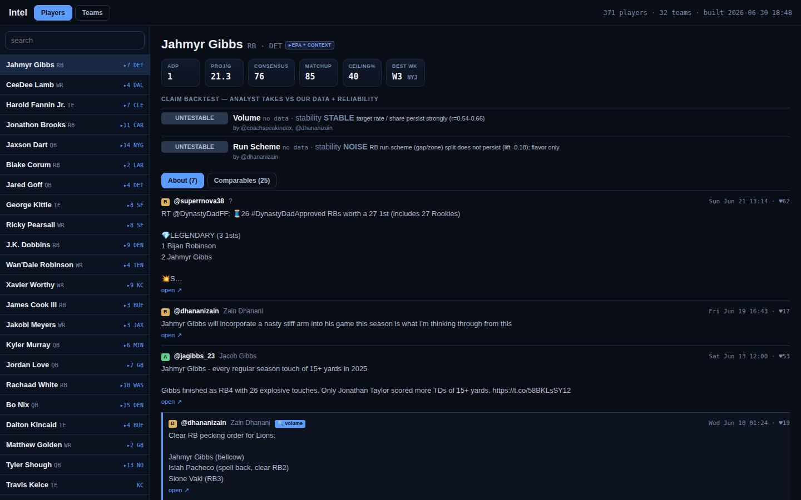
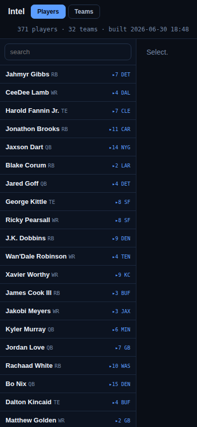

The hidden gem: analyst tweets scored against the model ("CLAIM BACKTEST — ANALYST TAKES VS OUR DATA + RELIABILITY", verdicts UNTESTABLE/SUPPORTED/…, stability notes like "target rate / share persist strongly (r=0.54-0.66)").

- **[P1 · understanding] FIXED — empty state said just "Select."** and the page title "Intel" explains nothing. New copy: "Select a player to see their tweet & video intel — analyst takes backtested against our data." (`render_intel.py:48,54` + `intel.html`). Remaining recommendation: retitle the H1 "Intel — tweets & analyst claims, backtested" in `render_intel.py`.
- **[P2 · understanding] Verdict chip vs stability text can conflict at a glance:** "UNTESTABLE" chip next to "stability STABLE … persist strongly". The chip grades the *claim's data*, the stability text grades the *metric class* — but nothing says so. Recommend a `title=` on the verdict chip ("verdict on this specific claim vs our data; stability describes whether this stat type persists year-to-year").
- **[P3] Left-list "▸7 DET" count is unlabeled** (intel item count). Tooltip.

---

## 3. Cross-cutting issues

- **C1 [P1 · core-action] Every dashboard except home is a navigational dead end.** Zero `<a>` tags on 15 of 16 pages (verified by DOM count). Open any board directly — or arrive from home — and there is no way back, no way sideways, no indication the suite exists. The single highest-leverage structural fix: a shared one-line nav strip (Home · Rankings · Big board · ADP tiers · Dossier · DFS · Intel) injected by each generator; the suite already shares visual tokens (dark navy, `--acc` blue) so one snippet fits all. (Recommendation — touches ~10 generators, not a safe spot-fix.)
- **C2 [P1 · trust] "Flags" means risk on one page and upside on the next.** rankings/dossier: ► flag = *risk* flag ("total risk flags"); adp_cluster_board FLAGS=11 and big_board FLAGS column = count of *positive* trait flags. A drafter who learns the word on one board will misread the other. Rename the positive ones to TRAITS.
- **C3 [P1 · core-action] Four "who do I draft" boards, three different #1 players, zero guidance.** rankings (#1 Nacua), big_board (#1 Gibbs), adp_cluster_board (tier-1 pick Bijan), command_center fusion (sorted by Cons → Stafford on top, which *looks* like a ranking). All four are defensible — different blends — but nothing tells the user which one to actually draft from, and the differences read as the models disagreeing with themselves. Fix: one subtitle line per board ("Use this when: …"), and home's Goal-1 card should name ONE primary list ("draft from the Rankings board; the others are lenses").
- **C4 [P2 · understanding] The same concept wears five names:** ceiling rate = "Ceil%" (rankings) = "CEILING%" (intel) = "α-ceiling / cl" (team_dashboard) = "boom" (various) = "40% ceil" badges. Pick "Ceil%" everywhere and expand once per page.
- **C5 [P2 · understanding] Percentile-vs-raw ambiguity recurs** (dossier ENV IDX, team_scout bars, big_board PO MQ, dfs TOTAL). The suite's own best practice — dossier_deep's "(PERCENTILE VS POSITION)" section title and rankings' tooltips — should be the standard.
- **C6 [P2 · trust] No-JS = blank page on every dashboard** (all content is JS-rendered from embedded JSON). Fine for a local tool; a `<noscript>Enable JS — this dashboard renders locally, no network needed</noscript>` line per template is cheap insurance and also reassures about privacy.
- **C7 [P3 · consistency] Header grammar varies per page** (title-only, title+toggle, title+tabs, no title at all on dossier_deep). Standardize: H1 + count + built-time + nav strip.
- **Positive cross-cutting finding:** the **4-layer context drilldown is reused verbatim on five pages** (command_center, rankings, player_explorer, upside_cases, intel, pick_dashboard via ▸EPA/▸CTX chips) — the strongest consistency asset in the suite. Build timestamps appear on 10+ pages. Data sources are named. These are real trust signals; the suite mostly needs *translation*, not new content.

---

## 4. Fixes applied (all in generators AND regenerated-file copies, verified by re-render)

| # | Fix | Generator (line) | Also patched (live file) |
|---|---|---|---|
| 1 | **Sticky-header corruption**: `th{top:96px}` → `top:0` — header no longer floats mid-table, no longer covers row 3, no longer intercepts row clicks | `_cc_template.html:18`, `render_dfs_week.py:30` | `command_center.html:18`, `dfs_week.html:16` |
| 2 | **"Pace 52th"** → "Pace 52 pctl" (badge on all 32 team dossiers) | `render_dossier.py:237` | `dossier.html:251` |
| 3 | **"college ceiling 91th pctl"** → "college ceiling 91 pctl" (rookie cards) | `render_dossier.py:226` | `dossier.html:240` |
| 4 | **"40% ceil ceil"** badge duplication → "40% ceil" | `_team_template.html:86` | `team_dashboard.html:107` |
| 5 | **Missing `<meta viewport>`** (real phones got zoomed-out 980px pages) | `build_adp_clusters.py:73`, `build_lever_board.py:33`, `_dash_template.html:1` | `adp_cluster_board.html`, `lever_board.html`, `pick_dashboard.html` |
| 6 | **intel empty state "Select."** → "Select a player to see their tweet & video intel — analyst takes backtested against our data." (players/teams variants) | `render_intel.py:48,54` | `intel.html:63,69` |
| 7 | **pick_dashboard unlabeled score column** → footnote now opens with "middle number = p95 weekly ceiling (DK pts)." | `_dash_template.html:21` | `pick_dashboard.html:42` |
| 8 | **Orphaned dashboards** → home hub now links Big board, ADP tiers (Goal 1) and Team intel board (Goal 3) | `build_home.py:60,69` | `home.html:39,48` |
| 9 | **rankings opaque columns** → `title=` tooltips on Edge / Proj/g / Ceil% / Cons (matches existing flag-column tooltip pattern) | `build_rankings.py:58` | `rankings.html:44` |

Every fix re-rendered and verified in Chromium: header geometry re-measured (th y=393 < row y=419; dfs_week th at table top), row-click drilldown now opens, "Pace 52 pctl" on BUF, "ceil ceil" absent from expanded DET, viewport metas present at 390px, new hub links resolve, tooltips read back from the DOM, zero new console/page errors on all touched pages.

---

## 5. The 5 issues hurting core-action most (ranked)

1. **The floating/click-eating table header on the two workhorse boards** (command_center, dfs_week) — *fixed*. It occluded a data row, put rows above their own header, and silently swallowed clicks on the top rows — the exact rows a user inspects first. Residual: make headers truly persist on scroll (wrapper `overflow` restructure, §2.2). **Impact: restores basic readability + the "click a row for why" loop on 379-player and 216-player tables.**
2. **No navigation between dashboards (C1).** A user who lands anywhere but home is stuck; a user on home who opens rankings can't reach the dossier without the back button, and can't discover upside_cases at all. Fix: shared nav strip in every generator. **Impact: turns 16 islands into one product; every downstream page gains a path to the pick-decision pages.**
3. **"Which board do I draft from?" (C3).** Three different #1 players across rankings / big_board / adp_cluster_board, plus a fusion table that looks like a ranking. Fix: one "use this when" subtitle per board + home naming a primary list. **Impact: removes the single biggest trust wobble for a new drafter — apparent self-disagreement — and shortens landing→list→pick.**
4. **The pick moment sends mixed signals (§2.12).** Verdict banner (Dart) vs highlighted #1 row (Kittle) vs a then-unlabeled score column (now labeled), and truncated names on phones. Fix: highlight the verdict row; unstarve the name column on mobile. **Impact: directly converts "confident pick" at the last step, where all other pages' value is realized.**
5. **Untranslated scores at point of use (C2/C4/C5 + per-page P1s).** Cons/Edge/Ceil% (partially fixed via tooltips), SZN/PLAYOFF/PEAK on lever_board, PO MQ on big_board, dTitle family on decision_dashboard, flags-valence collision. Fix: tooltips + one glossary line per page + rename positive FLAGS→TRAITS. **Impact: a normal user can defend a pick to themselves — the definition of "confident".**

## 6. Five quick wins fixable today

1. **Shared nav strip** — one HTML string, pasted into ~10 generators next to the H1 (the suite's headers are all single-line templates). Biggest payoff per line of code in the whole audit.
2. **"Use this board when…" subtitle** on rankings / big_board / adp_cluster_board / command_center — four one-line string edits (`build_rankings.py`, `build_big_board.py`, `build_adp_clusters.py`, `_cc_template.html`).
3. **Rename big_board & adp_cluster "FLAGS" → "TRAITS"** — two string edits, kills the risk/upside vocabulary collision (C2).
4. **Season-anchor the DFS page title** — `render_dfs_week.py`: "DFS Weekly Model — Week 15" → "… — 2026 Week 15 (projected slate)". One f-string.
5. **lever_board column tooltips + "teammates share a schedule" clause** — `build_lever_board.py`: three `title=` attributes and one sentence appended to the intro; converts the page's two trust-killers.

---

*Audit artifacts: 44 screenshots in `assets/` (43 referenced above, plus `command_center_desktop_fixed.png`, the post-fix verification shot; `command_center_scrolled.png` documents the pre-fix scrolled state that motivates the remaining sticky-header recommendation). Reproduce with `shoot.py` / `interact.py` in this directory (serve repo root on :8099 first: `python3 -m http.server 8099`).*
